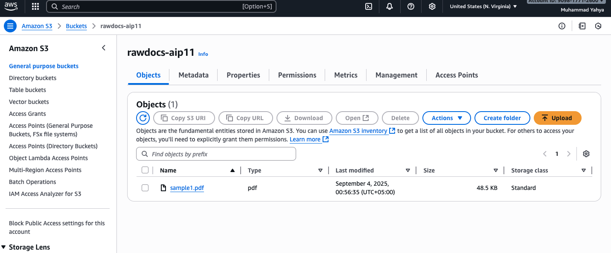
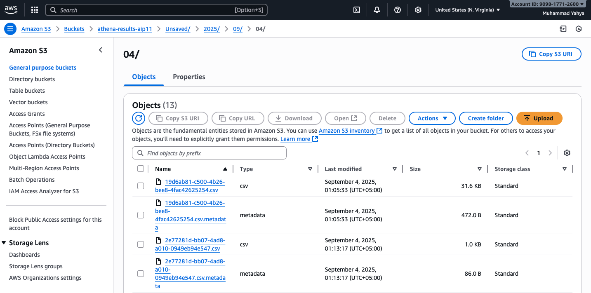
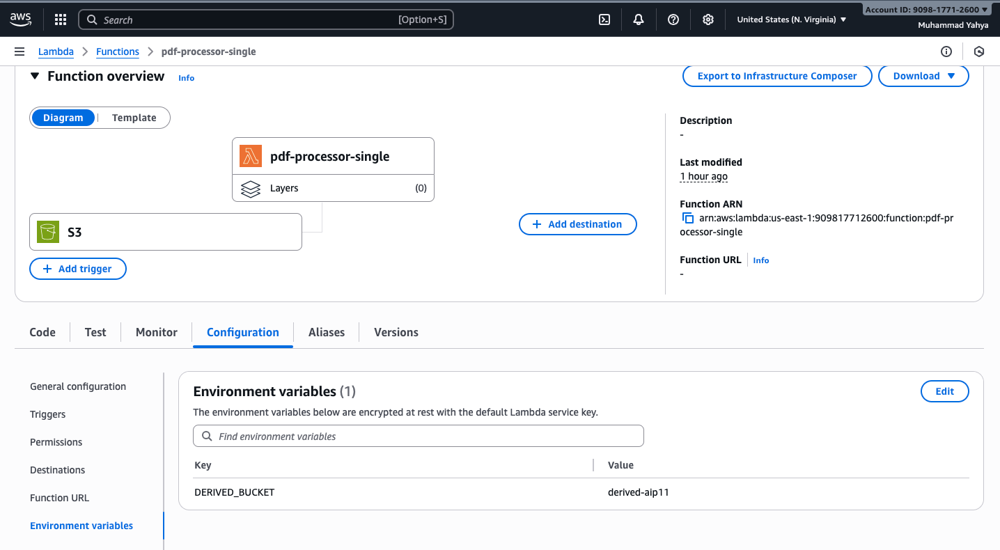
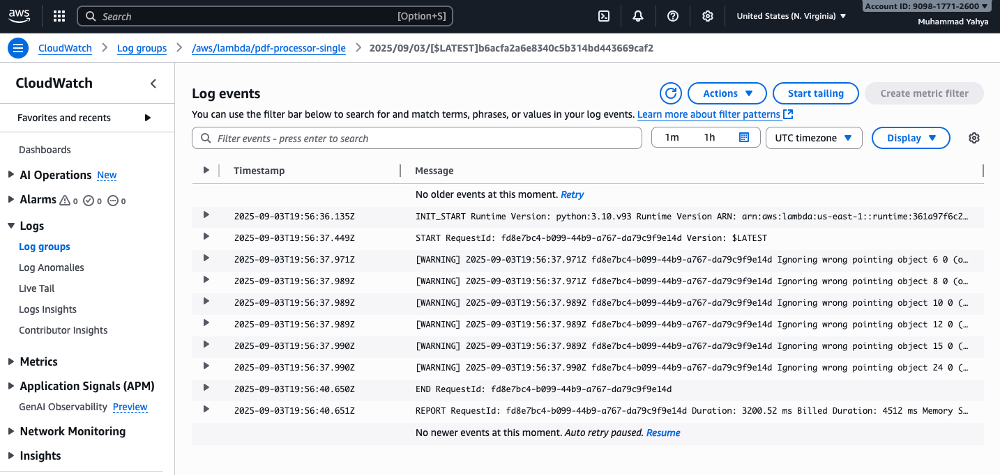
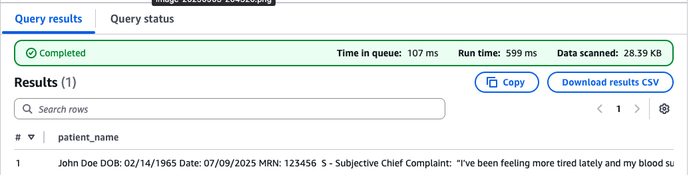
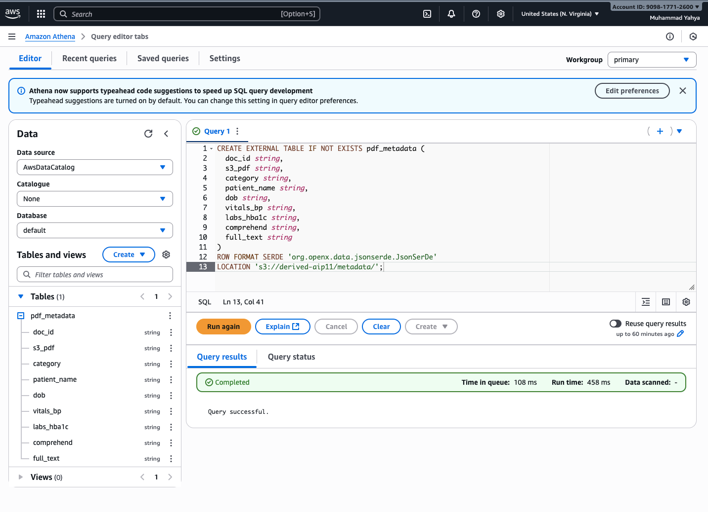
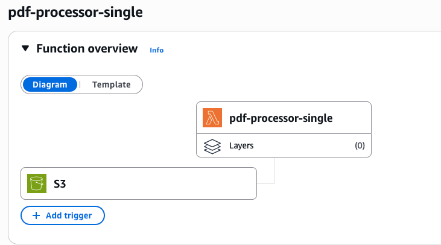

# Automated PDF Document Categorization & Metadata Extraction (Serverless Pipeline)

This project implements a serverless document processing pipeline using AWS services to automatically:

- Ingest digitally-native PDFs (no OCR required)

- Extract text with PyPDF

- Categorize content with rule-based logic + Amazon Comprehend

- Save structured metadata in Amazon S3

- Query metadata with Amazon Athena

- Store query results in a dedicated S3 bucket for further analysis

## 🚀 Architecture Overview

### Workflow:

- Upload PDF → S3 (rawdocs-aip11)

- S3 Event → triggers Lambda (pdf-processor-single)

- Lambda → extracts text, classifies, enriches with Comprehend

- Metadata JSON → stored in S3 (derived-aip11/metadata/)

- Athena → queries metadata in-place on S3

- Query results → saved automatically to S3 (athena-results-aip11)

- CloudWatch Logs → monitoring/debugging

## 🗂️ Buckets Used

- rawdocs-aip11 → Stores uploaded PDFs (input)



- derived-aip11 → Stores metadata JSON outputs (processed)


- athena-results-aip11 → Stores Athena query results



## 🔧 Components

### 1. Build Serverless Ingestion & Processing Pipeline

- S3 → Lambda Trigger: Every new PDF triggers **pdf-processor-single**.

- Lambda: Extracts text with PyPDF, classifies (SOAP note, invoice, etc.), and uses Amazon Comprehend to detect entities & enrich metadata.

- Output: JSON metadata stored in **derived-aip11/metadata/**.





### 2. Store Metadata in Searchable Format

- JSON metadata stored in **derived-aip11/metadata/**.

- Amazon Athena configured with a JSON SerDe schema (**pdf_metadata**).

- Queries run directly over JSON, results stored in **athena-results-aip11**.

- Sample Query:
    ```
    SELECT patient_name FROM pdf_metadata WHERE patient_name IS NOT NULL; 
    ```





### 3. Document Workflow Architecture

#### This architecture ensures:

- Serverless ingestion (S3 + Lambda)

- Text extraction & classification (PyPDF + Comprehend)

- Searchable storage (JSON in S3)

- Interactive querying (Athena SQL)

- Auditable results (stored in athena-results-aip11)



## 📦 Repository Contents

| File / Folder        | Description                                  |
|-----------------------|----------------------------------------------|
| `handler.py`          | Lambda entry point                          |
| `utils.py`            | Helper functions (PDF extraction, regex, classification) |
| `requirements.txt`    | Dependencies (`pypdf`, `typing_extensions`) |
| `lambda.zip`          | Deployment package (for Lambda)             |
| `screenshots`         | Contains relevant screenshots                            |
| `README.md`           | Project documentation                       |


